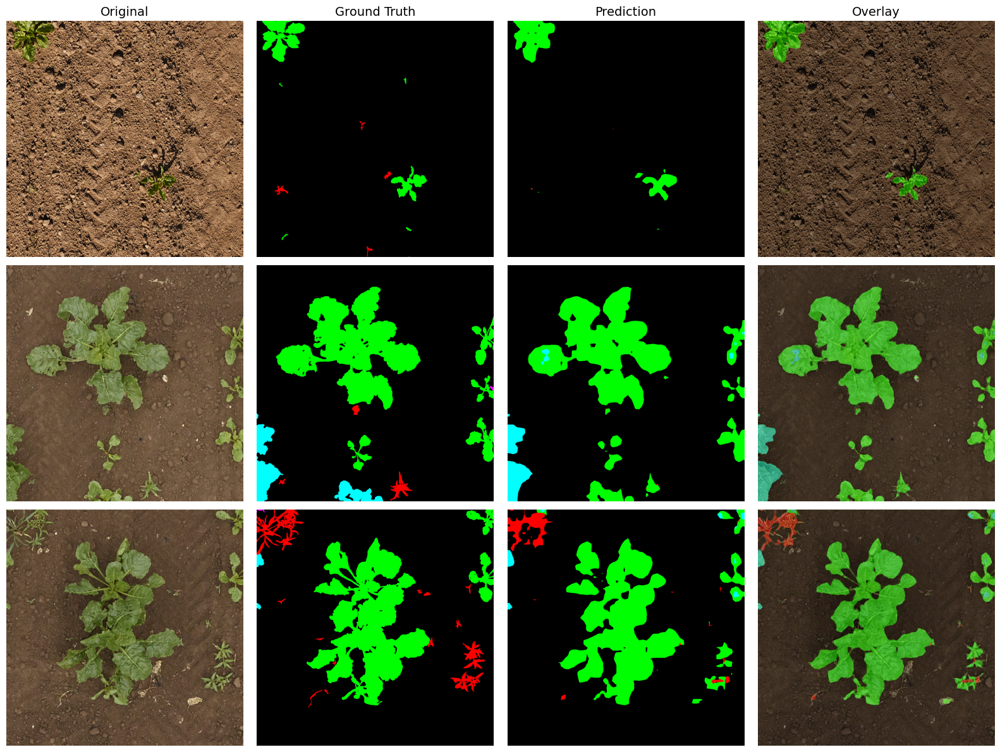
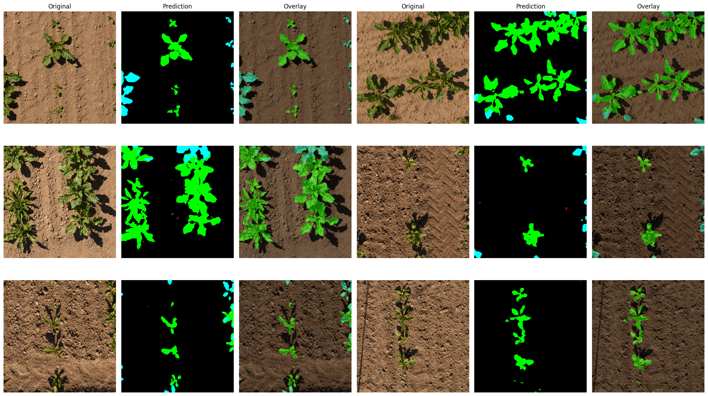

# PhenoBench Semantic Segmentation using Segmenter

## 🌱🍀 PhenoBench Dataset 

[](https://www.python.org)
[](https://pytorch.org)


This repository contains a semantic segmentation project focused on **interpretation in the agricultural domain** across **4 categories** using **Segmenter**.

---

## 🧭 Dataset Overview

The dataset includes the following 4 classes for semantic annotations:

| Class ID | Class Name             |
|--------- | ---------------------- |
| 0        | background             |
| 1        | crop                   |
| 2        | weed                   |
| 3        | partial-crop           |
| 4        | partial-weed           |

Total images: 2,872 

Total train images: 1,407 / Total val images: 772 / Total test images: 693

✅ Already semantic masks for training and validation.

---

## 🏗️ Model Architecture

- 📍 Model: **Segmenter**
- 📍 Backbone: **"ViT_tiny"**
- 📍 Framework: **PyTorch implementation of Segmenter**
- 📍 Input Size: **512 × 512**
- 📍 Normalization: **[0.5]x3 Mean/Std**

---

## 📊 Final Performance with epochs 10

Best model's mIoU = 0.4992

### 📈 Per-Class Evaluation Metrics:
```
Class              IoU   Prec    Rec     F1
----------------------------------------
background       0.973  0.988  0.985  0.986
crop             0.739  0.839  0.861  0.850
weed             0.330  0.612  0.418  0.497
partial-crop     0.557  0.661  0.779  0.715
partial-weed     0.026  0.253  0.029  0.052
```

---

## 🎨 Visualization Samples

The model outputs of **validation and testing sets** are visualized with:

- **Color-coded masks**
- **Overlay with transparent alpha control**  

📌 Example of val:
  

📌 Example of test:
  

---

## 🚀 How to Run Inference
```python
visualize_val_predictions(model, num_images=3, alpha=0.4)
```

```python
visualize_test_predictions(model, "/content/gdrive/MyDrive/yolov9-main/datasets/PhenoBench/test/images", num_images=6, alpha=0.4)
```
---

## 🔑 Summary

✅ Tested smallest model  
✅ No Augmentations  
✅ Only CE loss  
✅ **Note** Fastest but lower accuracy.  

---

## 📄 License

This project is intended for **academic research and educational use** only. Please cite **original dataset paper** or **appropriately to this repo** if used in publications.

---

## ⭐ Acknowledgements

- PyTorch implementation of Segmenter
- Based on Popular semantic segmentation benchmarking dataset `PhenoBench`

---
